# Mutual Fund SIP Discontinuation Analysis

An end-to-end analytics project investigating why mutual fund investors stop their SIPs (Systematic Investment Plans) — built across Excel, MySQL, Python, and Power BI to simulate a real BFSI/fintech analytics workflow.

---

## Business Problem

Systematic Investment Plan (SIP) discontinuation is a silent drag on AMC (Asset Management Company) revenue. Every lapsed SIP means lost recurring AUM, wasted acquisition cost, and a missed long-term investor relationship. Most AMCs only notice churn *after* it's happened — there's rarely a system flagging an investor **before** the third missed payment locks in a permanent lapse.

This project asks three business questions:
1. **Who** is at risk of discontinuing their SIP?
2. **When** in their investment lifecycle does risk peak?
3. **What early signals** (ticket size, category, missed-payment pattern) predict a lapse before it's final?

Churn is operationally defined as **3 consecutive missed monthly SIP payments** — the point at which most AMCs treat a SIP as functionally dead.

> **Note on data:** Real investor-level SIP data is not publicly available. This project uses a synthetically generated investor-month panel designed to mirror realistic SIP behavior patterns, so the pipeline and findings remain representative of real-world churn dynamics even though the underlying rows are simulated.

---

## Dataset

| Attribute | Value |
|---|---|
| Rows | 15,509 (investor-month panel) |
| Investors | 660 |
| Schemes | 21 |
| SEBI Categories | 10 |
| Time window | 36 months (Jul 2023 – Jun 2026) |
| Churn definition | 3 consecutive missed SIP payments |

Key columns: `investor_id`, `month_date`, `scheme_code`, `scheme_name`, `sebi_category`, `sip_amount`, `nav_value`, `payment_status`, `discontinued`, `tenure_months`, `city_tier`, `occupation_type`, `age`.

---

## Pipeline

```
Excel  →  MySQL (8 advanced SQL queries)  →  Python EDA (5 charts)  →  Power BI (2-page dashboard)
```

---

### Phase 1 — Excel: Initial Exploration

Built an `at_risk_flag` using `COUNTIF` as a first-pass, non-consecutive missed-payment proxy before the real churn logic was built in SQL.

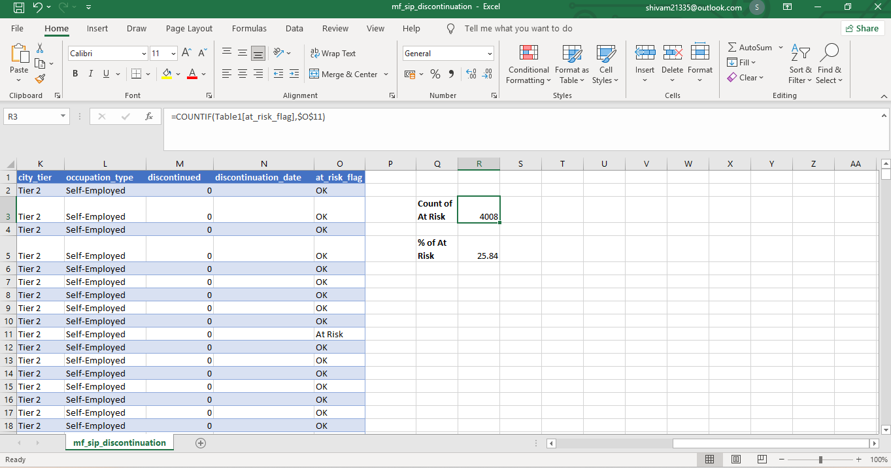
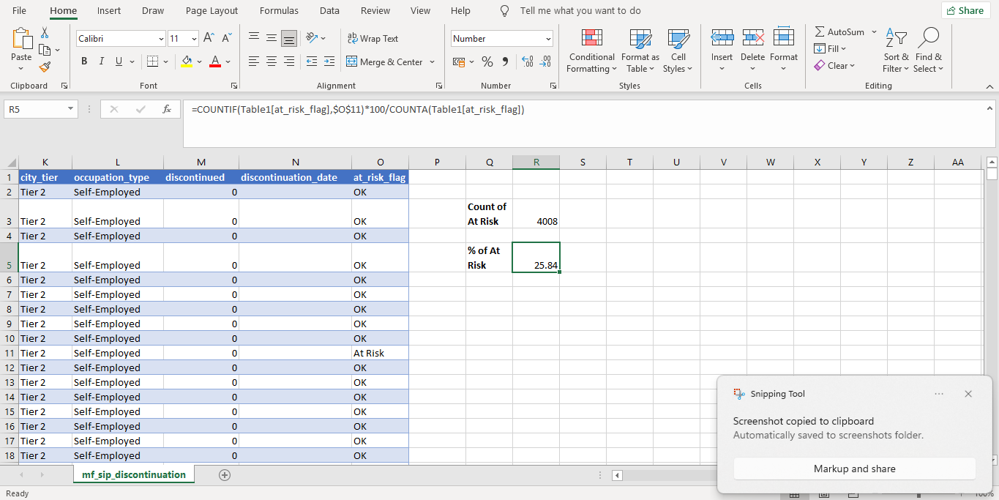

**Result: 4,008 rows flagged at-risk (25.84%)** — a row-level proxy, later superseded by investor-level SQL logic.

Pivot tables broke this down by category, city tier, and ticket size:

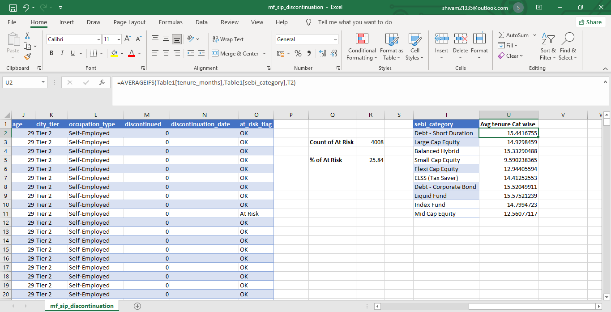
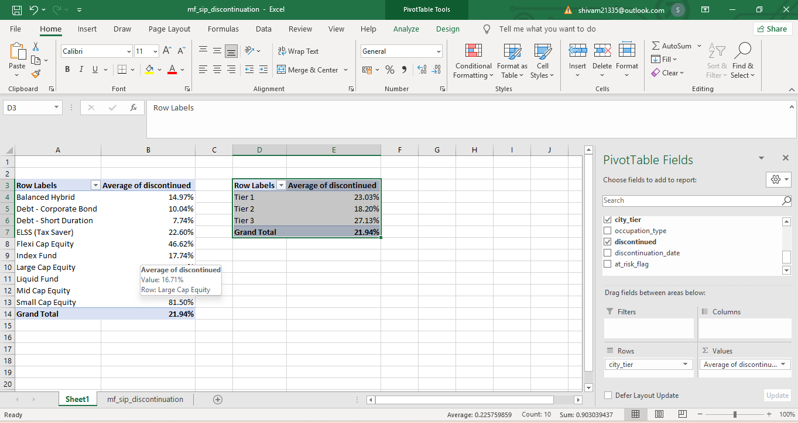
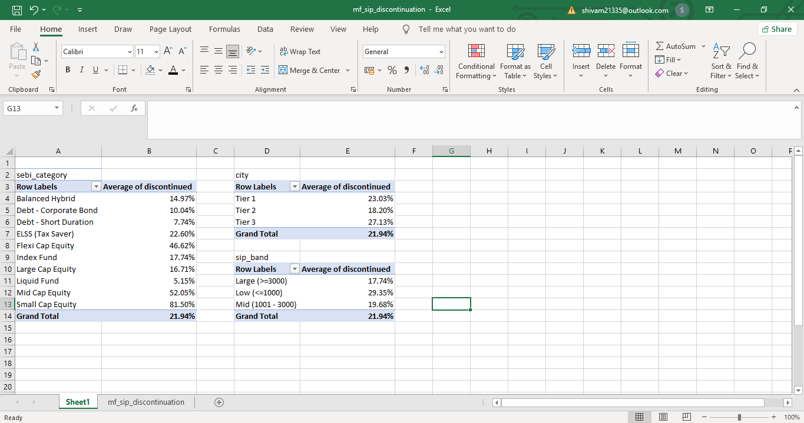

Early finding: city tier showed no meaningful churn pattern (23.03% / 18.20% / 27.13%) — a useful null result, not a bug. File: `mf_sip_analysis_phase1.xlsx`

---

### Phase 2 — MySQL: 8 Advanced SQL Queries

Data loaded via Python (`sqlalchemy` + `pymysql`) into a `sip_transactions` table (15,509 rows confirmed on load).

| Query | Technique | Business Question |
|---|---|---|
| Q1 | `LAG()` + gaps-and-islands CTE | Which investors show 3+ consecutive missed payments? |
| Q2 | `RANK()` partitioned by category | Who are the highest-risk investors within each SEBI category? |
| Q3 | `NTILE(4)` | How does churn vary across 4 equal-sized risk quartiles? |
| Q4 | Running window aggregate | How does an investor's reliability evolve month-over-month? |
| Q5 | `LEAD()` | How often does a single miss turn into a confirmed 3-miss streak vs. recover? |
| Q6 | `DENSE_RANK()` per category | Which specific schemes have the highest churn within their category? |
| Q7 | CTE + `AVG() OVER (PARTITION BY category)` | How does an investor's lapse tenure compare to their category's average? |
| Q8 | Cohort grouping + `COUNT(DISTINCT)` + `RANK()` | What % of each monthly cohort remains active over time? |

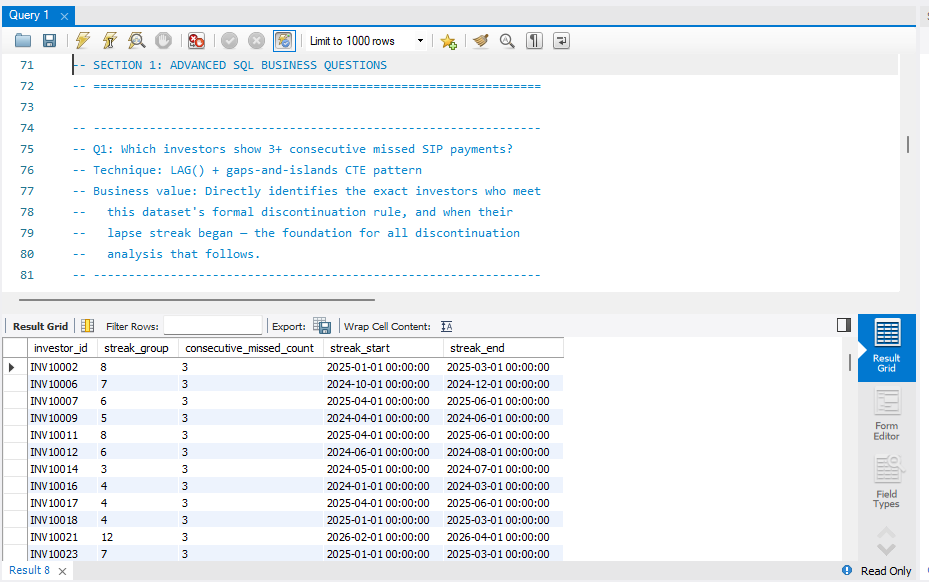
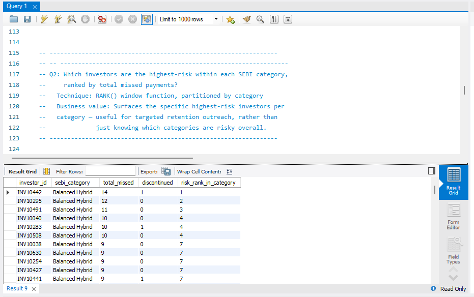
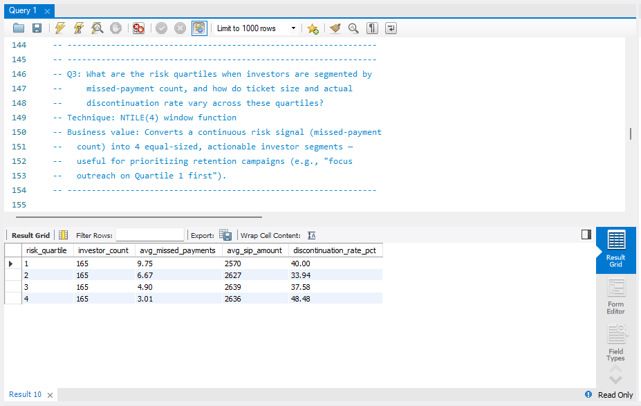
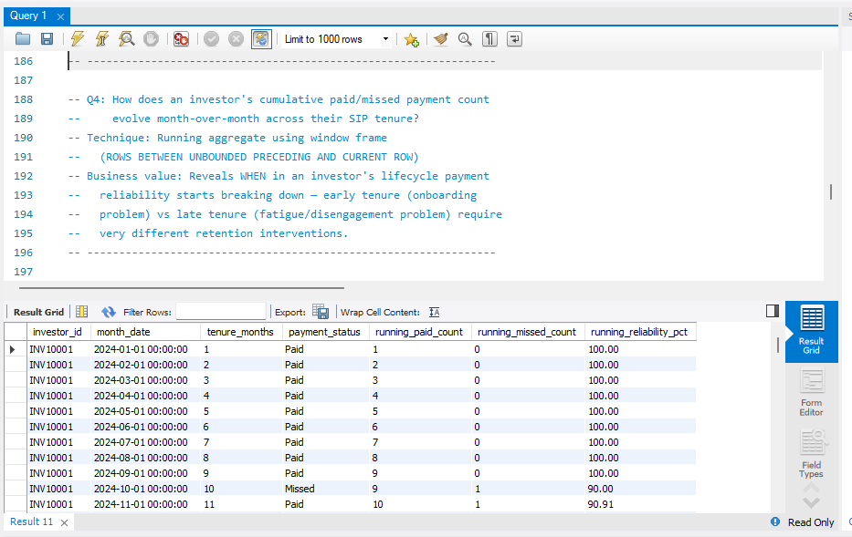
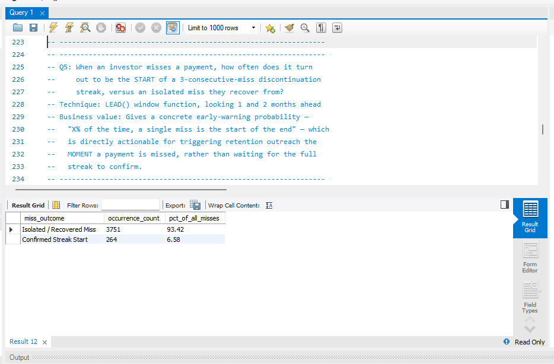
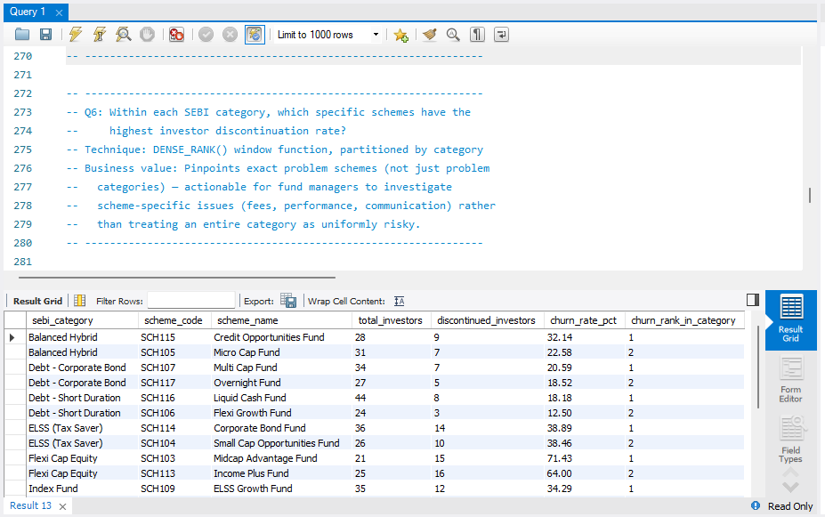
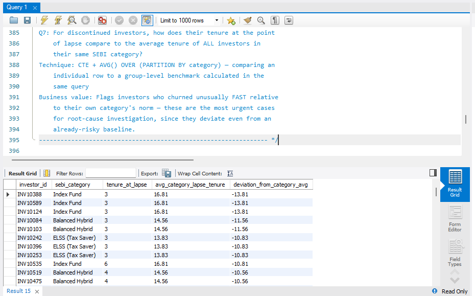
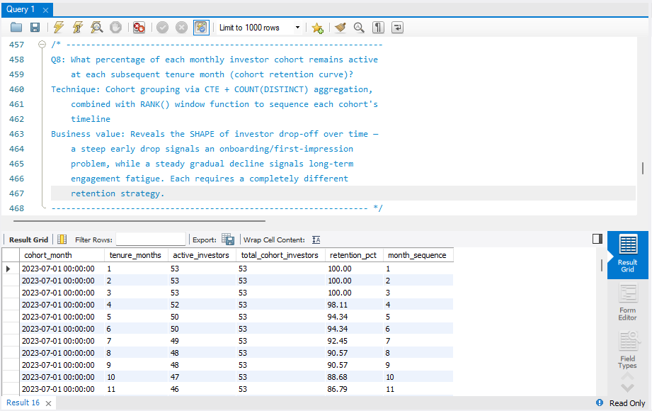

**Cross-validation finding:** Q1 (LAG), Q5 (LEAD), and Q8 (cohort) each *independently* returned **264 discontinued investors**, confirming the churn logic is internally consistent across three different SQL techniques.

File: `sql/mf_sip_analysis.sql`

---

### Phase 3 — Python EDA: 5 Charts

Environment: Jupyter, Pandas, Matplotlib. Connected to MySQL via SQLAlchemy.

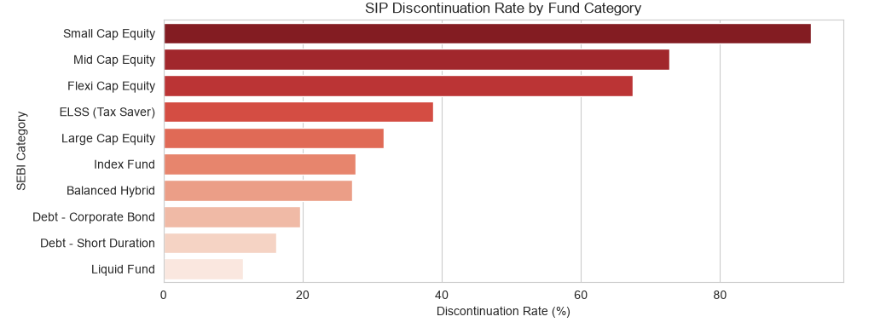
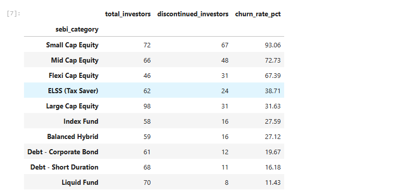

Small Cap Equity is the highest-risk category (93.06%), Liquid Fund the lowest (11.43%).

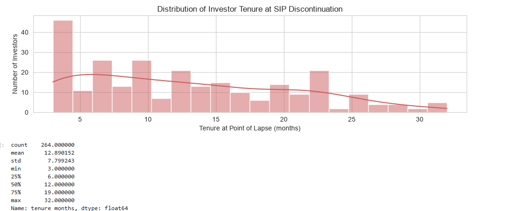

Mean tenure at lapse: 12.9 months, median 12, range 3–32 months.

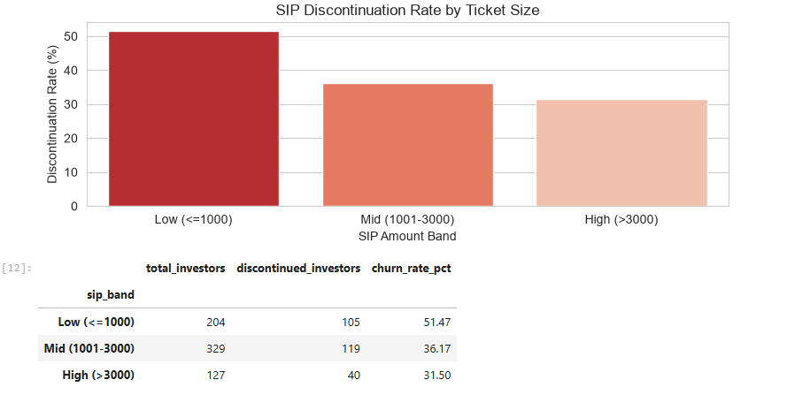

Clean inverse relationship: Low (≤₹1,000) tickets churn at 51.47%, High (>₹3,000) at 31.50%.

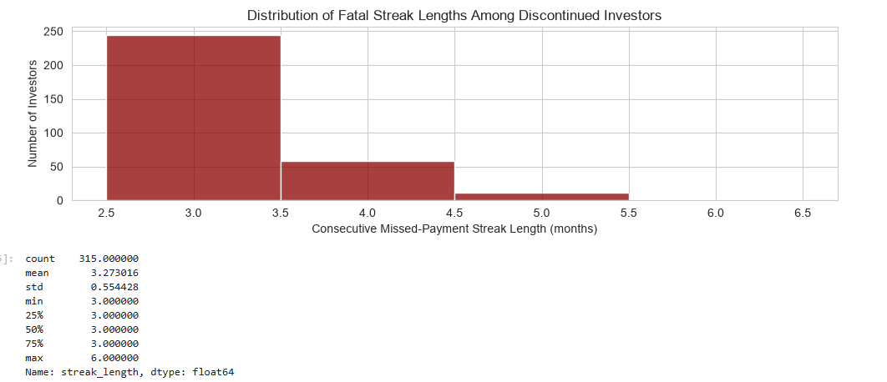

The vast majority of churned investors (≈245 of 315 streaks) lapse at *exactly* the minimum 3-month threshold — confirming the churn definition captures a real behavioral cliff, not an arbitrary cutoff.

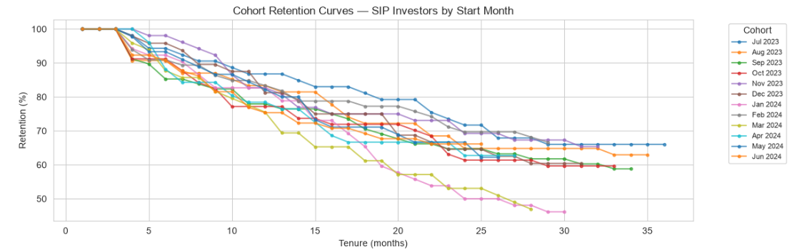

**Methodology finding:** row-level averaging of the `discontinued` flag systematically **underestimates** true investor-level churn. This was caught during Phase 3 and corrected using `DISTINCTCOUNT` / `COUNT(DISTINCT investor_id)` logic in both SQL and DAX.

File: `notebook/mf_sip_discontinuation_eda.ipynb`

---

### Phase 4 — Power BI: 2-Page Interactive Dashboard

**Page 1 — Overview** (the "what")

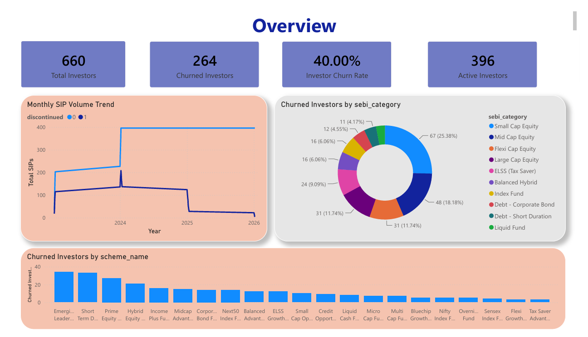

- KPI cards: Total Investors (660), Churned Investors (264), Investor Churn Rate (40.00%), Active Investors (396)
- Monthly SIP volume trend (active vs. discontinued)
- Donut: churned investors by SEBI category
- Bar chart: churned investors by scheme

**Page 2 — Diagnostic** (the "why")

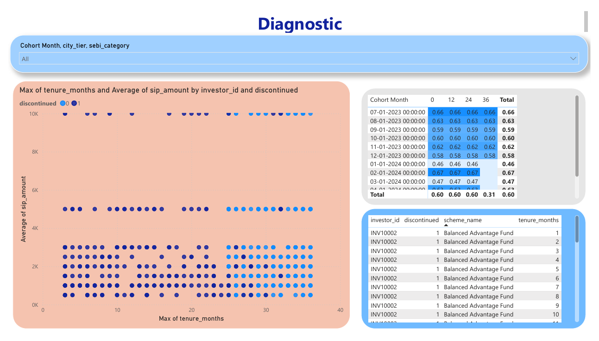

- Slicers: cohort month, city tier, SEBI category
- Scatter: tenure vs. ticket size, colored by churn status
- Cohort retention matrix (conditional-formatted heatmap)
- Investor-level detail table

File: `dashboard/mf_analysis_dash.pbix`

---

## Key Findings

- **Investor-level churn rate: 40%** (264 of 660), independently confirmed via 3 separate SQL techniques (LAG, LEAD, cohort analysis)
- **Category risk is highly uneven**: Small Cap Equity (93%), Mid Cap Equity (73%), and Flexi Cap Equity (67%) are the highest-risk categories; Liquid Fund (11%) and Debt – Short Duration (16%) are the most stable
- **Smaller ticket size = higher churn**: investors on ≤₹1,000 SIPs churn at 51%, vs. 31% for >₹3,000 SIPs
- **The 3-month threshold is a real behavioral cliff**, not an arbitrary rule — most churned investors lapse at exactly 3 consecutive misses
- **City tier is not a churn driver** — a deliberate null result that prevented over-fitting a spurious pattern
- **Risk quartiles are not perfectly monotonic**: the lowest-missed-payment quartile (Q4) still showed a 48.48% eventual discontinuation rate, higher than the two middle quartiles — missed-payment count alone doesn't fully predict churn
- **Scheme-level churn varies sharply within the same category** (Q6) — e.g. Midcap Advantage Fund churns at 71% while other schemes in the same category churn far less, meaning category-level fixes alone would miss scheme-specific problems

---

## Business Recommendations

1. **Prioritize retention outreach by category, not uniformly.** Small Cap, Mid Cap, and Flexi Cap Equity investors account for a disproportionate share of churn — concentrate retention budget here first rather than spreading it evenly across all 10 categories.

2. **Intervene at the first missed payment, not the third.** Q5 shows only 6.58% of single misses become a confirmed 3-month streak — but once a streak starts, the fatal-streak-length analysis shows it almost always ends at exactly 3 months. This means the highest-leverage intervention point is the **first missed payment**, not waiting for the pattern to confirm itself.

3. **Encourage step-up SIPs or minimum ticket nudges.** Low-ticket investors (≤₹1,000) churn at nearly double the rate of high-ticket investors. A step-up SIP feature or a modest minimum-ticket recommendation at onboarding could measurably reduce this segment's churn.

4. **Investigate underperforming schemes individually, not just their category.** Q6 shows churn varies sharply *within* the same SEBI category — e.g., Midcap Advantage Fund churns far more than category peers. Fund managers should review fees, performance, and communication for these specific schemes rather than assuming category-wide fixes will help.

5. **Time engagement campaigns around month 10–12 of tenure.** With median lapse tenure at 12 months, proactive check-ins, portfolio reviews, or loyalty incentives timed just before the 1-year mark could catch investors before the risk period peaks.

6. **Don't rely on missed-payment count alone for risk scoring.** The non-monotonic quartile result (Q3) shows churn risk needs to combine missed-payment count with ticket size and category — a multi-factor risk score would outperform any single signal.

---

## Business Solution

The deliverable is a **two-page, self-service Power BI dashboard** that lets a retention or operations team — without needing SQL or Python skills — monitor the overall churn picture (Page 1) and drill into the specific drivers behind it (Page 2). This turns a one-time analysis into a repeatable, filterable tool: a retention manager can filter to a single cohort month, category, or city tier and immediately see which investor segment needs outreach this month, rather than waiting on an analyst to rerun a report.

---

## Tech Stack

Excel · MySQL · Python (Pandas, Matplotlib, SQLAlchemy) · Power BI (DAX, Power Query)

---

## Repository Structure

```
mf-sip-discontinuation-analysis/
├── README.md
├── data/
│   ├── mf_sip_discontinuation.csv     (raw)
│   └── mf_sip_clean_v2.csv            (cleaned)
├── sql/
│   └── mf_sip_analysis.sql            (8 queries, Q1–Q8)
├── notebook/
│   └── mf_sip_discontinuation_eda.ipynb
├── dashboard/
│   └── mf_analysis_dash.pbix
└── screenshots/
    ├── P1_02a_countifs_formula.png
    ├── P1_02b_countifs_summary.png
    ├── P1_04_avg_tenure_by_category.png
    ├── P1_06_pivot_citytier_churn.png
    ├── P1_07_pivot_sipband_churn.png
    ├── P2_Q1_streak_detection_result.png
    ├── P2_Q2_rank_by_category_result.png
    ├── P2_Q3_risk_quartile_result.png
    ├── P2_Q4_running_reliability_result.png
    ├── P2_Q5_early_warning_result.png
    ├── P2_Q6_scheme_discontinuation_rank.png
    ├── P2_Q7_tenure_deviation_result.png
    ├── P2_Q8_cohort_retention_curve.png
    ├── P3_01_churn_by_category_chart.png
    ├── P3_01_churn_by_category_table.png
    ├── P3_02_tenure_to_churn_histogram.png
    ├── P3_03_ticket_size_vs_churn.png
    ├── P3_04_streak_length_distribution.png
    ├── P3_05_cohort_retention_curve.png
    ├── page1_overview.png
    └── page2_diagnostic.png
```

---

## Limitations & Next Steps

- Dataset is synthetically generated; directional findings (ticket size, category risk) are illustrative of real-world SIP behavior but not derived from actual AMC data
- The dashboard uses a filtered detail table rather than true Power BI drill-through, due to time constraints
- The cohort retention matrix on Page 2 is binned at a coarser interval (every ~12 months) rather than true month-by-month granularity
- Next iteration: replace the synthetic panel with real AMFI NAV/AUM data where investor-level granularity becomes available, and add a predictive churn-scoring model combining tenure, ticket size, category, and missed-payment streaks

---

## Author

Shivam Gupta
[LinkedIn](https://www.linkedin.com/in/shivam-gupta-ab453a237) · [GitHub](https://github.com/shivamconnect321-bot)
